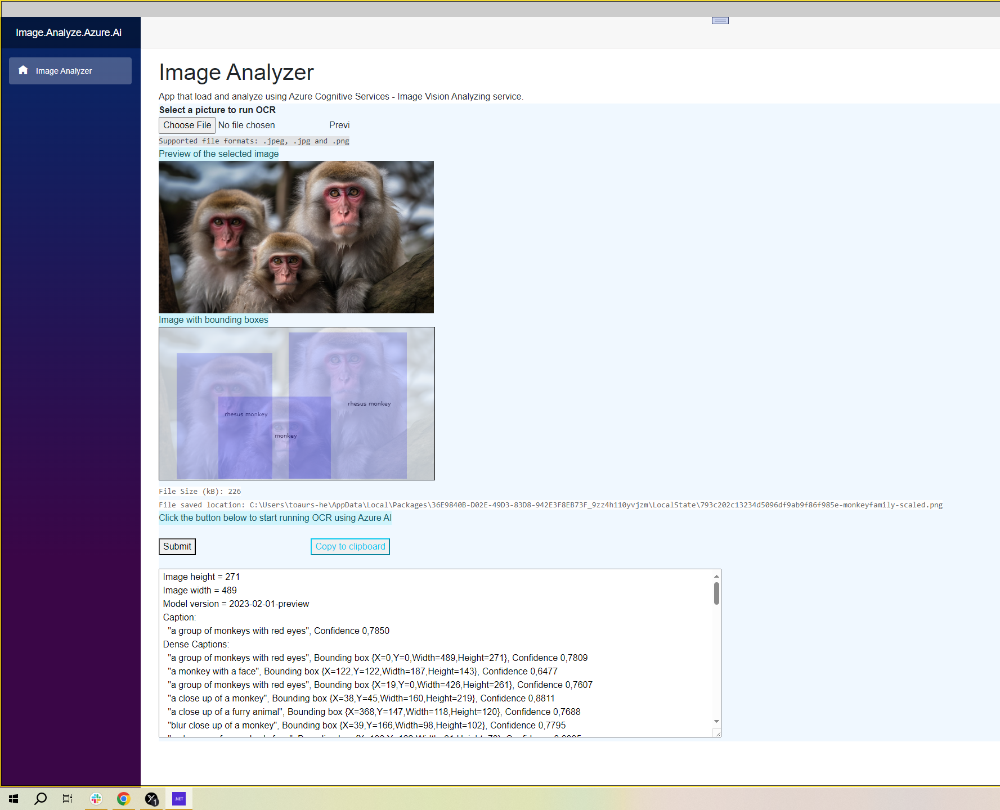

## Azure Image Analysis - MAUI Blazor app

This repo contains a MAUI Blazor app that can perform Image Analysis
on images uploaded to it using Azure Cognitive Services.

The Computer Vision service called Image Analysis is used.

The app will show bounding boxes drawn over the selected image and
annotated which objects (names) are present in the image. 

Sample run shown in the following screenshot : 

